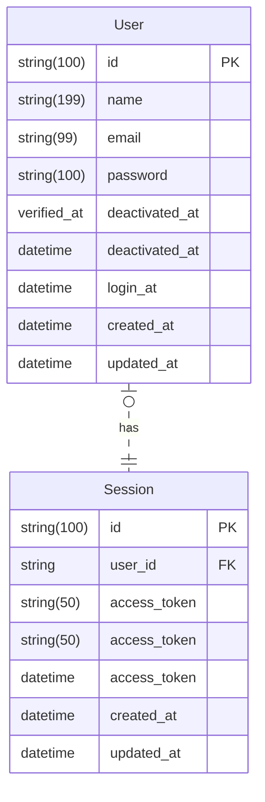

## Meld-CX Exam

### Requirements

- Node >=20.9
- MySQL 8

### Start

- `npm install`
- `npx prisma migrate dev`
- `node ./prisma/seeders/index.js`
- `yarn dev` or `npm run dev`

### Schema

```mermaid
erDiagram
    User |o..|| Session : has

    User {
        string(100) id PK
        string(199) name
        string(99) email
        string(100) password
        verified_at deactivated_at
        datetime deactivated_at
        datetime login_at
        datetime created_at
        datetime updated_at
    }

    Session {
        string(100) id PK
        string user_id FK
        string(50) access_token
        string(50) access_token
        datetime access_token
        datetime created_at
        datetime updated_at
    }
```
