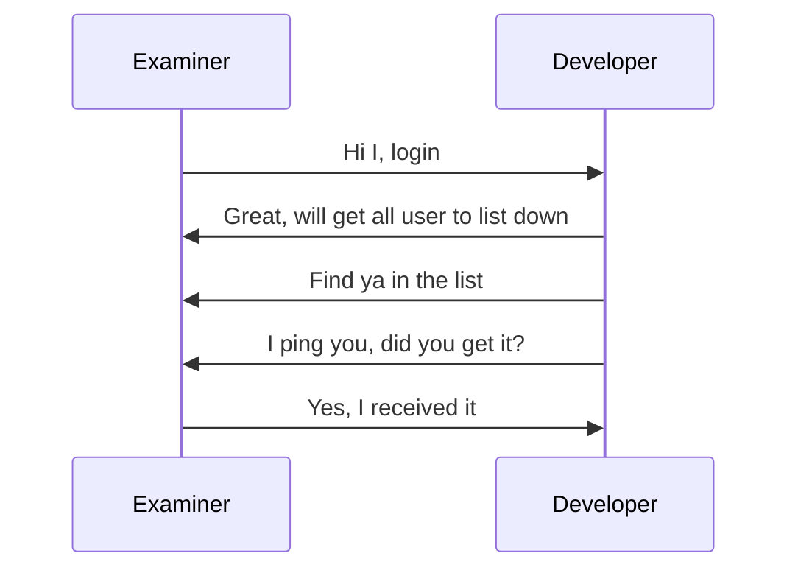
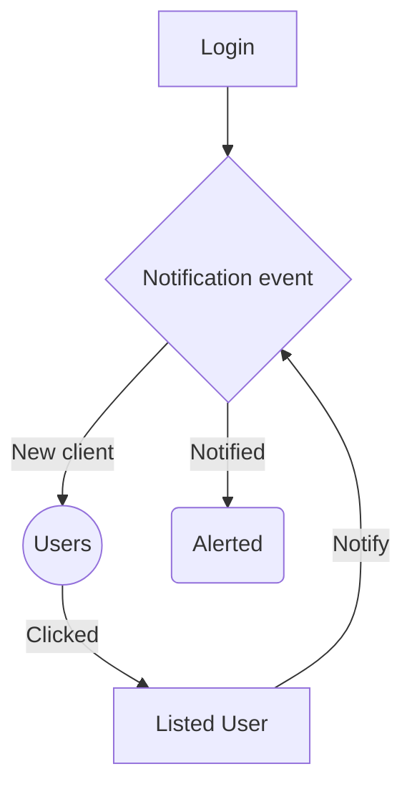

## Meld-CX Exam

### Requirements

- Node >=20.9
- MySQL 8

### TechStack

- WebSocket
- NextJS

### Start

- `cp .env.example .env`
- Replace the values
- `docker compose up -d`
- `npm install`
- `npx prisma migrate dev`
- `node ./prisma/seeders/index.js`
- `yarn dev` or `npm run dev`

### Credentials

**Username** | **Password**
---------|---------
`exam@examiner.com` | `Default123!`
`dev@examiner.com` | `Default123!`

### Sequence

### Flowchart (notification)

### Schema

